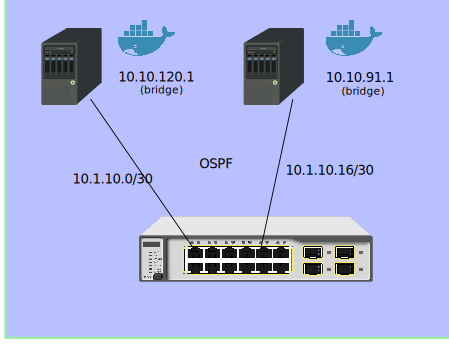

Quanta LB6M
===========
:toc:

Introduction
------------

According to Metcalfe's law, the value of the network is proportional to the
square of the number of connected users.  With squared values in mind, check
out this config with several 10 GBit/s *Intel X520-DA2* & *Mellanox ConnectX-2
MNPH29C-XTR* NICs, and a *Quanta LB6M*, which is inexpensive 10 GBit/s switch
which came new from *UNIXSurplus*.  The cabling I use is a 3m Active Optical
Cable, the *AVAGO AFBR-2CAR03Z*.

Here's the version information of this switch derived from the command
'show version'.

--------------------------------------
System Description............................. Quanta LB6M, 1.2.0.18, Linux
                                                2.6.21.7
Machine Type................................... Quanta LB6M
Machine Model.................................. LB6M
Serial Number.................................. QTFCRW6030118
FRU Number..................................... 1LB6BZZ0STJ
Part Number.................................... BCM56820
Maintenance Level.............................. A
Manufacturer................................... 0xbc00
Burned In MAC Address.......................... 54:AB:3A:42:0B:40
Software Version............................... 1.2.0.18
Operating System............................... Linux 2.6.21.7
Network Processing Device...................... BCM56820_B0
Additional Packages............................ FASTPATH QOS
--------------------------------------

There are 24 SFP+ ports on the Quanta LB6M as well as a two copper Gigabit
ports and two management ports.  The FASTPATH software on the LB6M also
supports OSPF, which distribute Layer 3 routes dynamically as devices are added
and subtracted from the network.  In this article I will show how OSPF can be
used for container style networking.

My primary use case for using OSPF is to allow containers to connect to other
containers through virtual bridges defined on each host.  Each virtual bridge
defines a network and OSPF configures the routes for these networks.  Without
dynamic configuration, I would need to define static routes on each host for
every other host -- this would become unmanageble very quickly.  Protocols such
as Docker Swarm also enable dynamic configuration through other mechanisms, but
the scope is limited to containers controlled by Docker.

Installation
------------

The serial port on the LB6M defaults to 9600-N-1, no flow control.  The blue
Cisco style cable works well, but my switch did not include this.  It will also
use DHCP to configure the managment port, so you can use 'telnet' to connect to
it initially by setting up dhcpd and serving an address to the switch.

The configuration language used is a version of LVL7 FASTPATH, which is an NOS
that is now a part of Broadcom.  The examples here contain FASTPATH prompts
that signify the mode of configuration the switch is in.  They are described
here: <<config-modes>>.

Enabling 'ssh' and Disabling 'telnet'
~~~~~~~~~~~~~~~~~~~~~~~~~~~~~~~~~~~~~

The first configuration item I did was setting up 'ssh' and 'ntp'.  While
telnet works, ssh is secure and ubiquitous.

* Set the prompt.  FASTPATH Routing hurts my eyes.
--------------------------------------
(FASTPATH Routing) #set prompt LB6M
--------------------------------------

* Set the login password.
--------------------------------------
(LB6M) >password
Enter old password:
Enter new password:********
Confirm new password:********
Password Changed!
--------------------------------------

* Generate the 'ssh' keys for the switch.
--------------------------------------
(LB6M) (Config)#crypto key generate rsa
(LB6M) (Config)#crypto key generate dsa
--------------------------------------

* Enable the 'ssh' server and extend the idle timeout, kill telnet.  Use 'ssh'
for connecting, for example *ssh admin@192.168.1.1*, using the password set
above.
--------------------------------------
(LB6M) #sshcon timeout 160
(LB6M) #ip ssh protocol 2
(LB6M) #ip ssh server enable
(LB6M) #no ip telnet server enable
--------------------------------------

* Enable the client time synchronization, presuming that dhcpd hands out
a DNS resolver and a route to the NTP server.
--------------------------------------
(LB6M) (Config)#sntp server 3.north-america.pool.ntp.org
(LB6M) (Config)#sntp client mode unicast 
--------------------------------------

* Save the config to startup_config and reboot.
--------------------------------------
(LB6M) #write mem
(LB6M) #reload
--------------------------------------

Port Identification
~~~~~~~~~~~~~~~~~~~

There are two types of ports that are present in the configuration, physical
ports that can be connected with a wire, and logical ports, which are not
wired.  The logical ports enable features of that don't require physical ports
or group multiple physical ports together:  LAGs, VLANs, Loopbacks, Tunnels.

The physical ports are number 0/1 -> 0/28 in slot/port notation, and the
logical ports are numbered 1/1 -> 1/64.  These logical ports are used by the
Broadcom chipset to accelerate processing.  The logical port range 2/1 and
beyond are features handled by the CPU.

Configuration
-------------

Create some VLANs
~~~~~~~~~~~~~~~~~

It's always a good idea to partition management functions and data forwarding
functions on seperate VLANs.  I'll create 3 VLANs for my switch and use VLAN 30
for my OSPF network.

--------------------------------------
(LB6M) #vlan database
(LB6M) (Vlan)#vlan 10,20,30
(LB6M) (Vlan)#vlan name 10 "MGMT"
(LB6M) (Vlan)#vlan name 20 "L2-NET"
(LB6M) (Vlan)#vlan name 30 "L3-NET"
(LB6M) #exit
(LB6M) #network mgmt_vlan 10
--------------------------------------

Setting up the IP Addresses
~~~~~~~~~~~~~~~~~~~~~~~~~~~

For each port on the switch that will use OSPF to redistribute the routes in
my network, I need an address.  This is the addressing scheme I used.

--------------------------------------
port 1 = 10.1.10.1  /30 -> 10.1.10.2  /30 = host 1
port 2 = 10.1.10.5  /30 -> 10.1.10.6  /30 = host 2
port 3 = 10.1.10.9  /30 -> 10.1.10.10 /30 = host 3
port 4 = 10.1.10.13 /30 -> 10.1.10.14 /30 = host 4
port 5 = 10.1.10.17 /30 -> 10.1.10.18 /30 = host 5
--------------------------------------

The first address is assigned to the port and the second is assigned to the
interface on the host connected to the switch.  The following will assign
addresses to the first 5 ports using VLAN 30.  

--------------------------------------
(LB6M) (Config)#interface 0/1-0/5
(LB6M) (Interface 0/1-0/5)# routing
(LB6M) (Interface 0/1-0/5)# vlan participation include 30
(LB6M) (Interface 0/1-0/5)# vlan pvid 30
(LB6M) (Interface 0/1-0/5)# exit
(LB6M) (Config)#interface 0/1
(LB6M) (Interface 0/1)# ip address 10.1.10.1 255.255.255.252
(LB6M) (Interface 0/1)# exit
(LB6M) (Config)#interface 0/2
(LB6M) (Interface 0/2)# ip address 10.1.10.5 255.255.255.252
(LB6M) (Interface 0/2)# exit
(LB6M) (Config)#interface 0/3
(LB6M) (Interface 0/3)# ip address 10.1.10.9 255.255.255.252
(LB6M) (Interface 0/3)# exit
(LB6M) (Config)#interface 0/4
(LB6M) (Interface 0/4)# ip address 10.1.10.13 255.255.255.252
(LB6M) (Interface 0/4)# exit
(LB6M) (Config)#interface 0/5
(LB6M) (Interface 0/5)# ip address 10.1.10.17 255.255.255.252
(LB6M) (Interface 0/5)# exit
--------------------------------------

Without OSPF running on the switch and the host, the only addresses that are
visible is on the link between the two.  I used Quagga Zebra to assign the
address of this host.  After bringing the interface up and connecting it to
the switch, 'ping' the interface address to verify the link.

--------------------------------------
host1# cat /etc/quagga/zebra.conf
!
hostname host1
log file /var/log/quagga/quagga.log
!
interface te1
 ip address 10.1.10.2/30
!
ip forwarding
!
line vty
!

host1# systemctl start zebra
host1# ping 10.1.10.1
PING 10.1.10.1 (10.1.10.1) 56(84) bytes of data.
64 bytes from 10.1.10.1: icmp_seq=1 ttl=64 time=4.77 ms
64 bytes from 10.1.10.1: icmp_seq=2 ttl=64 time=0.717 ms
--------------------------------------

Setting up OSPF
~~~~~~~~~~~~~~~

There are two parts for OSPF.  The interface needs to be told what OSPF area it
is and the OSPF router needs a bit of config to be uniquely identified and what
routes should be distributed to others.  On the LB6M, this is the config
needed.

--------------------------------------
(LB6M) (Config)#router ospf
(LB6M) (Config-router)#router-id 10.3.2.68
(LB6M) (Config-router)#network 10.1.10.0 255.255.255.127 area 0.0.0.0
(LB6M) (Config-router)#redistribute connected
(LB6M) (Config-router)#redistribute static
(LB6M) (Config-router)#exit
--------------------------------------

The router-id is a unique IP address, I used the management interface here.
The network defines the addresses on the switch.  The redistribute connected
and static tell the router to replicate the routes defined by configuration and
the routes learned from connected devices.

Next, tell the interfaces that they are OSPF enabled and what *area* they are
pushing and pulling.  The area segments the network boundaries for OSPF, this
enables other protocol features which aren't used here.

--------------------------------------
(LB6M) (Config)#interface 0/1-0/5
(LB6M) (Interface 0/1-0/5)#ip ospf area 0.0.0.0
(LB6M) (Interface 0/1-0/5)#exit
--------------------------------------

Finally, configure 'ospfd' on each of the hosts.

--------------------------------------
host1# cat /etc/quagga/ospfd.conf
!
hostname host1
password zebra
!enable password please-set-at-here
!
interface te1
  ip ospf area 0
!
router ospf
  ospf router-id 10.3.2.120
  network 10.10.120.0/24 area 0
!
log file /var/log/quagga/ospf.log

host1# systemctl start ospfd
--------------------------------------

The interface named *te1* is the same that is configured in the zebra.conf
file.  It is connected to the switch on port 1.  The network 10.10.120.0/24
is a virtual bridge defined on this host.

After the hosts have ospfd running, the routing tables should be populated with
routes labeled *zebra*.

--------------------------------------
host1# ip route show | grep zebra
10.1.10.16/30 via 10.1.10.1 dev te1 proto zebra metric 20 
10.10.91.0/24 via 10.1.10.1 dev te1 proto zebra metric 20 
--------------------------------------

The 10.1.10.X/30 routes are the hosts connected to port 2 -> 5.  The
10.10.X.0/24 routes are the virtual bridges defined on these hosts.

On the switch, the 'show ip route' command displays these routes as well.

--------------------------------------
(LB6M) #show ip route 

Route Codes: R - RIP Derived, O - OSPF Derived, C - Connected, S - Static
       B - BGP Derived, IA - OSPF Inter Area
       E1 - OSPF External Type 1, E2 - OSPF External Type 2
       N1 - OSPF NSSA External Type 1, N2 - OSPF NSSA External Type 2

C      10.1.10.0/30 [0/1] directly connected,   0/1
C      10.1.10.16/30 [0/1] directly connected,   0/5
O      10.10.91.0/24 [110/11] via 10.1.10.18,   02h:31m:30s,  0/5
O      10.10.120.0/24 [110/11] via 10.1.10.2,   02h:32m:50s,  0/1
--------------------------------------

Documentation
-------------

There are a couple of sources I used for finding information about the LB6M.

* Although some features are not present, the ICOS NOS guides are helpful:
https://netbergtw.com/wp-content/uploads/Files/ICOS_cli_guide.pdf[ICOS CLI
Guide].

* Some of the configuration examples in the STH forums are helpful:
https://forums.servethehome.com/index.php?threads/quanta-lb6m-10gbe-discussion.8002/[Quanta
LB6M (10GbE) -- Discussion]

* The GNU Quagga documentation:
http://www.nongnu.org/quagga/docs/docs-info.html#OSPFv2[OSPFv2]

[appendix]
[[config-modes]]
The FASTPATH Configuration Modes
--------------------------------

* *User EXEC* -- this is the initial mode after logging in.
--------------------------------------
(LB6M) >
--------------------------------------

* *Privileged EXEC* -- this is entered from *User EXEC* by the 'enable' command.
--------------------------------------
(LB6M) #
--------------------------------------

* *Global Config* -- this is entered from *Privileged EXEC* by the 'configure'
command and exited using 'exit'.
--------------------------------------
(LB6M) (Config)#
--------------------------------------

* *Interface Config* -- this is entered from *Global Config* by the 'interface'
command and exited using 'exit'.  To apply configuration to multiple
interfaces, a range may be specified.
--------------------------------------
(LB6M) (Config)#interface 0/1
(LB6M) (Interface 0/1)#exit
(LB6M) (Config)#interface 0/16-0/24
(LB6M) (Interface 0/16-0/24)#shutdown
(LB6M) (Interface 0/16-0/24)#exit
--------------------------------------

* *VLAN Config* -- this is entered from *Privileged EXEC* by the 'vlan database'
command and exited using 'exit'.
--------------------------------------
(LB6M) (Vlan)#
--------------------------------------

Transitioning between these modes looks like this.
--------------------------------------
(LB6M) >enable              <-- User EXEC to Privileged EXEC
Password:
(LB6M) #vlan database       <-- Privileged EXEC to VLAN Config
(LB6M) (Vlan)#exit
(LB6M) #configure           <-- Privileged EXEC to Global Config
(LB6M) (Config)# exit
(LB6M) #exit
(LB6M) >quit                <-- Logout
--------------------------------------

